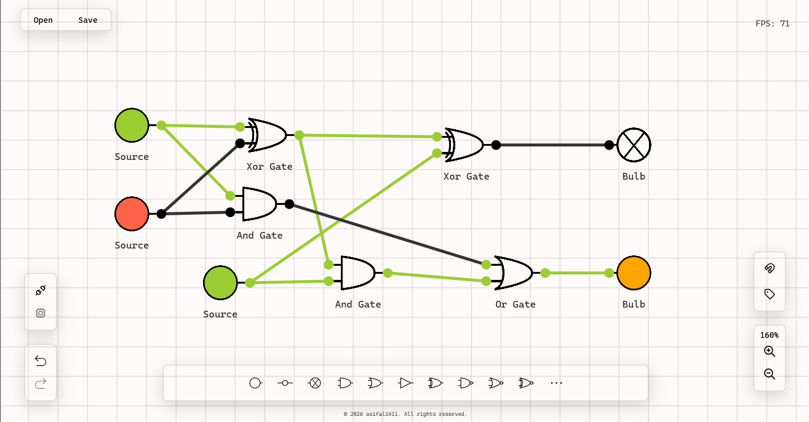

# OpenSignal

A desktop circuit simulator application built with Tauri, allowing users to design and simulate digital circuits interactively.



## Features

- Interactive circuit design with click-and-drag components
- Support for various logic gates (AND, OR, NOT, NAND, NOR, XOR, XNOR)
- Electrical devices including bulbs, switches, and sources
- Real-time circuit simulation and state visualization
- Undo/redo functionality for circuit editing
- Save and load circuit designs

## Prerequisites

Before running this application, ensure you have the following installed:

- [Node.js](https://nodejs.org/) (version 16 or later)
- [Rust](https://www.rust-lang.org/) (latest stable version)
- For Windows: Visual Studio Build Tools (for native dependencies)

## Installation

1. Clone the repository:
   ```bash
   git clone https://github.com/asifali411/OpenSignal.git
   ```

2. Install dependencies:
   ```bash
   npm install
   ```

3. Run the application in development mode:
   ```bash
   npm run tauri dev
   ```

## Building

To build the application for production:

```bash
npm run tauri build
```

This will create distributable binaries in the `src-tauri/target/release/bundle/` directory.

## Usage

- Launch the application using `npm run tauri dev`
- Click components on the toolbar
- Connect components by clicking on their pins
- Use the switch components to toggle inputs
- Observe the bulb states to see circuit outputs
- Use the history controls to undo/redo changes

## Project Structure

- `src/`: Frontend TypeScript code
  - `scripts/devices/`: Circuit component definitions
  - `scripts/events/`: Event handling logic
  - `main/`: Core application logic
- `src-tauri/`: Rust backend code
- `styles/`: CSS stylesheets
- `solver/`: Circuit simulation logic

## Contributing

Contributions are welcome! Please feel free to submit a Pull Request.

## Technologies Used

- **Frontend**: TypeScript, HTML, CSS
- **Backend**: Rust (Tauri)
- **Build Tool**: Vite